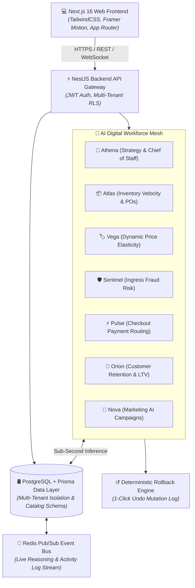
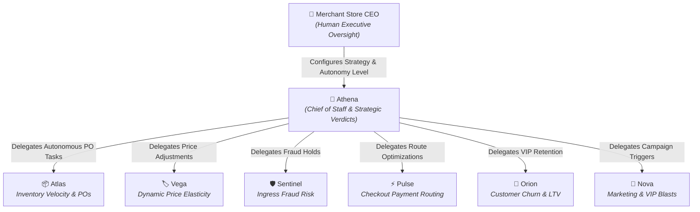

<div align="center">

# MerchantPilot AI

### The AI Commerce Operating System

**Autonomous digital employees that analyze, reason, forecast, protect, and execute commerce operations.**

[](https://merchantpilot-ai-web.vercel.app)

[](https://nextjs.org/)
[](https://www.typescriptlang.org/)
[](https://www.postgresql.org/)
[](https://www.prisma.io/)
[](https://www.docker.com/)
[](LICENSE)

---

### 🌐 Live Production Application & Demo Sandbox

> **Live Web App:** [https://merchantpilot-ai-web.vercel.app](https://merchantpilot-ai-web.vercel.app)  
> **Executive Login:** `demo@merchantpilot.ai`  
> **Password:** `Demo@123!`

---

</div>

## Overview

MerchantPilot AI replaces static e-commerce dashboards with an **autonomous digital workforce of 7 specialized AI executives**. Instead of human managers checking 10 separate tools every morning, MerchantPilot continuously monitors stock velocity, scrapes competitor pricing, intercepts ingress fraud, optimizes checkout routing, and executes personalized customer campaigns.

---

## 🏛️ System Architecture



---

## 🤖 AI Workforce Hierarchy



---

## 🔄 Autonomous Multi-Agent Decision Pattern

```mermaid
sequenceDiagram
    autonumber
    actor Merchant as 👤 Merchant CEO
    participant Athena as 👑 Athena (Chief of Staff)
    participant Atlas as 📦 Atlas (Inventory)
    participant Vega as 🏷️ Vega (Pricing)
    participant DB as 🛢️ Multi-Tenant DB
    participant Rollback as ↺ Rollback Engine

    Merchant->>Athena: Prompt / Auto-Trigger ("Optimize Revenue & Stock")
    Athena->>Atlas: Request Stock Velocity & Out-of-Stock Risk
    Atlas-->>Athena: Stock Alert: Low stock on Laptop Stand (12 units left)
    Athena->>Vega: Request Elasticity Check & Competitor Price Scrape
    Vega-->>Athena: Optimal Strategy: Restock 80 units & Price +4.5%

    rect rgb(30, 30, 45)
        note over Athena,Vega: Multi-Agent Debate & Verdict Synthesis
        Athena->>Athena: Calculate Combined Confidence Score (96%)
    end

    alt AutoPilot Autonomy = Semi-Autonomous (Approval Required)
        Athena->>Merchant: Present Action Plan in AI Action Center
        Merchant->>Athena: Approve Transaction
    else AutoPilot Autonomy = Fully Autonomous
        Athena->>Athena: Auto-Approve Policy Enforced
    end

    Athena->>DB: Execute Catalog Mutation & Update Stock
    Athena->>Rollback: Register Undo State (1-Click Undo Enabled)
    DB-->>Merchant: Real-Time UI Stream & Continuous Thinking Ticker Updated
```



---

## 🤖 Digital Executive Roster

| Agent | Name         | Role & Specialization         | Key Metrics Handled                                |
| ----- | ------------ | ----------------------------- | -------------------------------------------------- |
| 👑    | **Athena**   | Chief of Staff & Strategy     | Business Health Score (95/100), Executive Verdicts |
| 📦    | **Atlas**    | Inventory & PO Specialist     | Safety Stock, Out-of-Stock Reduction, Lead Times   |
| 🏷️    | **Vega**     | Dynamic Pricing & Elasticity  | Monte Carlo Curves, Gross Margin Lift %            |
| 🛡️    | **Sentinel** | Fraud & Security Sentinel     | IP/VPN Ingress Scoring, Fraud Holds                |
| ⚡    | **Pulse**    | Checkout Payment Intelligence | Gateway Routing (Razorpay/Cashfree/PayU SLA)       |
| 🎯    | **Orion**    | Customer Retention & LTV      | RFM Matrix, Customer Lifetime Value (LTV)          |
| 🚀    | **Nova**     | Marketing & Campaign AI       | WhatsApp VIP Blasts, Promotional Coupons           |

---

## Feature Capabilities

### ⚡ AI & Autonomous Operations

- **Multi-Agent Debate Engine:** Deliberative cross-examination between agents before executive verdicts.
- **Action Preview Modal:** Pre-execution simulation showing exact revenue, margin, and risk impact.
- **Deterministic Rollback:** Git-like 1-click undo capability for all automated catalog mutations.
- **Hands-Free Voice AI:** Hands-free speech interaction with live state transitions (`Listening` -> `Transcribing` -> `Reasoning` -> `Executing`).

### 🔒 Enterprise & Security

- **Multi-Tenant Data Isolation:** Row Level Security (RLS) and AES-256 data partitioning.
- **AI AutoPilot Governance:** Per-domain autonomy configuration (`Manual`, `Semi-Auto`, `Fully Autonomous`).
- **Trust Center (`/trust`):** Real-time model accuracy metrics (98.4%), sub-second 420ms decision latency, and SOC2 readiness badges.

---

## 📂 Repository Layout

```
merchantpilot-ai/
├── apps/
│   ├── api/                  # NestJS Multi-Tenant Backend Gateway
│   └── web/                  # Next.js 16 (Turbopack) UI Shell & AI Engines
├── docs/                     # Architecture, API, AI Agents, Deployment & Pitch Script
│   ├── ai-agents.md
│   ├── api.md
│   ├── architecture.md
│   ├── deployment.md
│   └── pitch-script.md
├── packages/                 # Shared Configs & Prisma ORM Schema
├── .env.example              # Environment Configuration Template
├── docker-compose.yml        # Docker Multi-Container Compose Config
├── LICENSE                   # MIT License
├── README.md                 # Project Overview & Setup Guide
└── SECURITY.md               # Vulnerability Reporting & Security Policy
```

---

## ⚡ Quick Start & Local Setup

```bash
# 1. Clone the repository
git clone https://github.com/merchantpilot/merchantpilot-ai.git
cd merchantpilot-ai

# 2. Install workspace dependencies
pnpm install

# 3. Environment configuration
cp .env.example .env

# 4. Database migrations & seed
pnpm prisma migrate dev

# 5. Run development servers
pnpm dev
```

---

## 🗺️ Roadmap

- [x] **v1.0.0** — Autonomous Digital Workforce, Multi-Agent Debate, Voice AI & Trust Center
- [ ] **v1.1.0** — Modular AI Agent Marketplace Extension Store
- [ ] **v1.2.0** — Voice Workflow Automation & Multi-Channel Telephony Routing
- [ ] **v1.3.0** — Autonomous Procurement Engine with direct supplier API dispatch

---

## 📄 License & Security

Licensed under the [MIT License](LICENSE). Refer to [SECURITY.md](SECURITY.md) for vulnerability disclosure policies.
