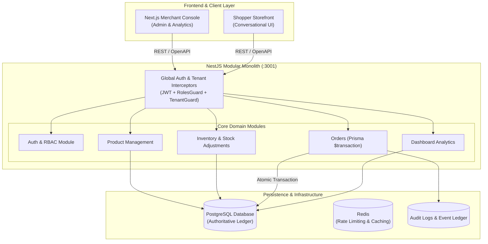

# MerchantPilot AI

> **Explainable AI Commerce Platform for Modern Retail & Indian D2C Merchants**
> Turning browsing and purchase intent into high-converting, measurable revenue opportunities through conversational shopping, explainable recommendations, transactional order orchestration, and robust multi-tenant guardrails.

---

## 📑 Table of Contents

- [Overview](#overview)
- [System Architecture](#system-architecture)
- [Core Modules & Capabilities](#core-modules--capabilities)
- [Security & Multi-Tenant Isolation](#security--multi-tenant-isolation)
- [API Reference & Swagger](#api-reference--swagger)
- [Tech Stack](#tech-stack)
- [Monorepo Structure](#monorepo-structure)
- [Getting Started](#getting-started)
  - [Prerequisites](#prerequisites)
  - [Installation & Environment Setup](#installation--environment-setup)
  - [Database Migration & Seeding](#database-migration--seeding)
  - [Running the Services](#running-the-services)
- [Verification & Quality Gates](#verification--quality-gates)
- [Roadmap & Next Steps](#roadmap--next-steps)

---

## 🌟 Overview

Merchants typically sit on vast product catalogs and transaction histories without a trustworthy, automated layer that connects customer intent to higher basket values.

**MerchantPilot AI** bridges this gap:

1. **Explainable AI Decisions**: Every recommendation comes with human-readable rationale and merchant policy auditability.
2. **Transactional Integrity**: Atomic order placement with automatic stock reservation, deduction, and automated replenishment on cancellations.
3. **Multi-Tenant Security**: Strict tenant isolation across merchants, stores, roles, and resources.
4. **Actionable Analytics**: Real-time revenue metrics, order velocity, inventory health, and top-selling product insights.

---

## 🏛️ System Architecture



---

## 📦 Core Modules & Capabilities

| Module          | Endpoints                                                                                                                                                  | Key Capabilities                                                                                                                                                                                                                     |
| --------------- | ---------------------------------------------------------------------------------------------------------------------------------------------------------- | ------------------------------------------------------------------------------------------------------------------------------------------------------------------------------------------------------------------------------------ |
| **Auth & RBAC** | `POST /auth/register`<br/>`POST /auth/login`<br/>`POST /auth/refresh`<br/>`GET /auth/me`                                                                   | Argon2 hashing, dual JWT tokens (Access + Refresh rotation), Role hierarchy (`MERCHANT_OWNER`, `MERCHANDISER`, `SUPPORT_AGENT`, `PLATFORM_OPERATOR`).                                                                                |
| **Products**    | `POST /products`<br/>`GET /products`<br/>`GET /products/:id`<br/>`PATCH /products/:id`<br/>`DELETE /products/:id`                                          | Multi-tenant catalog CRUD, SKU uniqueness validation per store, Category relations, status lifecycle (`DRAFT`, `ACTIVE`, `OUT_OF_STOCK`, `ARCHIVED`), pagination & keyword search.                                                   |
| **Inventory**   | `GET /inventory`<br/>`GET /inventory/low-stock`<br/>`GET /inventory/:productId`<br/>`PATCH /inventory/:productId/adjust`<br/>`PATCH /inventory/:productId` | Atomic delta/absolute adjustments, reorder threshold alerts, automatic stock exhaustion detection, audit logging of quantity shifts.                                                                                                 |
| **Orders**      | `POST /orders`<br/>`GET /orders`<br/>`GET /orders/:id`<br/>`PATCH /orders/:id/status`                                                                      | **`prisma.$transaction`** orchestration: validates catalog & store, ensures stock availability, atomically decrements stock, updates product status on depletion, records audit log, and handles inventory rollback on cancellation. |
| **Dashboard**   | `GET /dashboard`                                                                                                                                           | High-level merchant metrics: Today's & Total Revenue, Order counts, Catalog size, Low-stock alerts, Top-selling products by quantity, and Recent order activity.                                                                     |

---

## 🔒 Security & Multi-Tenant Isolation

MerchantPilot AI implements strict multi-tenancy at the gateway and repository levels:

1. **Authentication Guard (`JwtAuthGuard`)**: Validates the JWT bearer token, extracts user ID, merchant ID, store ID, and assigned roles.
2. **Tenant Guard (`TenantGuard`)**: Ensures the requested store or merchant belongs strictly to the authenticated context. Prevents cross-tenant data leakage.
3. **Roles Guard (`RolesGuard`)**: Enforces granular permissions on write endpoints (e.g. `MERCHANT_OWNER` or `MERCHANDISER` required for catalog modifications; `SUPPORT_AGENT` has read-only access).

---

## 📖 API Reference & Swagger

Interactive Swagger/OpenAPI documentation is automatically generated and accessible when running the API:

- **Swagger UI**: [http://localhost:3001/api/docs](http://localhost:3001/api/docs)
- **OpenAPI JSON**: [http://localhost:3001/api/docs-json](http://localhost:3001/api/docs-json)

---

## 💻 Tech Stack

- **Monorepo Engine:** [Turborepo](https://turbo.build/) + [pnpm](https://pnpm.io/)
- **Backend API:** [NestJS](https://nestjs.com/) (Node.js / TypeScript)
- **Database & ORM:** [PostgreSQL](https://www.postgresql.org/) with [Prisma ORM](https://www.prisma.io/)
- **Validation & Serialization:** `class-validator`, `class-transformer`
- **Security:** `@nestjs/jwt`, `argon2`, `passport-jwt`
- **Testing:** [Vitest](https://vitest.dev/)
- **Code Quality:** ESLint, Prettier, Husky, lint-staged

---

## 📂 Monorepo Structure

```text
merchantpilot-ai/
├── apps/
│   ├── api/                     # NestJS modular backend service
│   │   └── src/
│   │       ├── auth/            # JWT authentication, hashing, guards
│   │       ├── products/        # Product catalog & CRUD management
│   │       ├── inventory/       # Stock tracking & low-stock alerts
│   │       ├── orders/          # Transactional order engine
│   │       ├── dashboard/       # Merchant analytics & KPI aggregation
│   │       └── common/          # Global filters, decorators, interceptors
│   ├── web/                     # Next.js frontend console (Merchant portal)
│   ├── ai-service/              # FastAPI retrieval & explanation service
│   └── worker/                  # Asynchronous task processor & webhooks
├── packages/
│   ├── database/                # Prisma schema, migrations, seed script, client
│   ├── contracts/               # Shared DTOs and API interface contracts
│   ├── config/                  # Shared environment and config parsers
│   └── observability/           # Logging & tracing utilities
├── docs/                        # Architecture & design specifications
└── README.md
```

---

## 🚀 Getting Started

### Prerequisites

- **Node.js**: `v22.x` or later
- **pnpm**: `v10.x` or later (`corepack enable pnpm`)
- **Docker** & **Docker Compose** (for PostgreSQL)

### Installation & Environment Setup

1. **Clone the repository:**

   ```bash
   git clone https://github.com/Karthik-Siraparapu-1/merchantpilot-ai.git
   cd merchantpilot-ai
   ```

2. **Install dependencies:**

   ```bash
   pnpm install
   ```

3. **Configure environment variables:**
   ```bash
   cp .env.example .env
   ```

### Database Migration & Seeding

1. **Start the PostgreSQL database:**

   ```bash
   docker compose up -d postgres
   ```

2. **Generate Prisma Client & Run Migrations:**

   ```bash
   pnpm --filter @merchantpilot/database db:generate
   pnpm --filter @merchantpilot/database db:migrate
   ```

3. **Seed rich sample data (20 products, categories, inventories, realistic orders):**
   ```bash
   pnpm --filter @merchantpilot/database db:seed
   ```

### Running the Services

Start the development server with Turbo:

```bash
pnpm dev
```

Or run the NestJS API specifically:

```bash
pnpm --filter @merchantpilot/api dev
```

API will be live at `http://localhost:3001` with Swagger docs at `http://localhost:3001/api/docs`.

---

## 🧪 Verification & Quality Gates

The project maintains 100% test passing and strict code quality:

```bash
# Run all unit and controller tests
pnpm --filter @merchantpilot/api test

# Run typechecking
pnpm --filter @merchantpilot/api typecheck

# Run lint checks
pnpm --filter @merchantpilot/api lint

# Build production bundle
pnpm --filter @merchantpilot/api build
```

---

## 🗺️ Roadmap & Next Steps

- [x] Multi-tenant Authentication & Role-Based Access Control
- [x] Product Management with Category & SKU integrity
- [x] Inventory Management with low-stock detection & atomic adjustments
- [x] Transactional Orders Engine with automatic stock deduction & audit trails
- [x] Merchant Dashboard Analytics (`/dashboard`)
- [x] Database Seeder with 20 rich catalog products & sample orders
- [ ] Razorpay Test Mode Payment Gateway Webhook integration
- [ ] AI-Powered Explainable Recommendation & Upsell microservice integration
