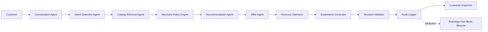

# AI Agent Design

## 1. Design objective

The MerchantPilot AI agent assists product discovery and revenue growth without becoming an uncontrolled decision maker. Its inputs are tenant-scoped customer context and merchant-approved data; its outputs are advisory, schema-validated commerce decisions. Pricing, inventory, eligibility, payment, and authorization are deterministic API responsibilities.

## 2. Agent pipeline

The orchestrator makes each stage observable and versioned. A failure or policy rejection terminates unsafe branches and chooses an explicit fallback; it never silently substitutes unsupported output.

## 3. Required decision envelope

Every displayable AI decision shall be persisted before return with this logical schema:

| Field | Requirement |
|---|---|
| `decision_id` | Immutable UUID, correlated to request/conversation/cart where relevant |
| `tenant_id` / `storefront_id` | Required tenancy and channel binding |
| `decision_type` | `conversation_answer`, `recommendation`, `upsell`, or `suppression` |
| `intent` | Structured intent, extracted constraints, and ambiguity flags |
| `candidate_ids` / `selected_ids` | Retrieved and selected catalog variants, in rank order |
| `confidence_score` | Calibrated decimal 0–1 with score version |
| `explanation` | Customer-facing concise reason plus machine reason codes |
| `retrieved_evidence` | Source IDs, content/version hashes, and exact structured facts used |
| `policy_evaluation` | Policy version, checks, rejections, overrides, eligibility result |
| `model_metadata` | Model, prompt/template version, retrieval/index version, latency, fallback flag |
| `audit_record` | Actor/session, timestamp, request ID, outcome, redacted input fingerprint |

If `confidence_score`, `explanation`, `retrieved_evidence`, or `audit_record` is absent, the response is suppressed. The system stores evidence and outputs, not hidden reasoning traces.

## 4. Agents

### Intent Detection Agent

**Purpose:** transform a shopper utterance and approved conversation summary into a structured intent object.

**Extracts:** product category, use case, budget/currency, required attributes, compatibility, quantity, stated exclusions, urgency, language, and ambiguity. It cannot infer sensitive traits or silently convert a vague phrase into a hard constraint.

**Output:** JSON conforming to an allowlisted taxonomy with field-level source (`explicit`, `inferred`, `unknown`) and extraction confidence. Invalid output is rejected and falls back to keyword/filter parsing plus a clarification question.

### Catalog Retrieval Agent

**Purpose:** produce a recall-oriented candidate set from the tenant's active, merchant-approved catalog and knowledge sources.

**Method:** combine lexical/attribute filters with vector retrieval; retrieve variant-level catalog facts and product text. Tenant ID, storefront, product status, category restrictions, and source approval are mandatory filters before similarity ranking. It records source IDs, content hashes, ranking scores, and index version.

**Prohibitions:** no cross-tenant vectors, deleted/unpublished items, price facts from embeddings, or customer private data in retrieval queries.

### Recommendation Agent

**Purpose:** rank eligible candidates for stated intent.

**Inputs:** structured intent, candidates, live authoritative price/stock, customer cart context, merchant policy, experiment assignment.

**Rules:** remove inactive/out-of-stock candidates; enforce budget/explicit constraints; cap output count; diversify where policy allows; do not use opaque personal profiling. Ranking may use semantic relevance, attribute match, availability, merchant-defined prioritization, and experiment variant. It returns score components and standardized reason codes such as `USE_CASE_MATCH`, `BUDGET_MATCH`, `ATTRIBUTE_MATCH`, `IN_STOCK`, and `MERCHANT_PRIORITY`.

### Upsell Agent

**Purpose:** identify optional complementary items or offers that increase basket value without degrading relevance or violating policy.

**Rules:** base proposal on cart compatibility/complementarity; exclude items already in cart, unavailable variants, prohibited categories, expired offers, and offers exceeding merchant discount/margin limits. Never auto-add, imply a discount not configured, or withhold the base product to force an upsell. The response explicitly marks suggestions as optional.

### Revenue Optimizer

**Purpose:** choose the best customer-appropriate decision among policy-qualified candidates using merchant-defined growth goals. It must not maximize revenue by misleading the customer, breaking a stated budget, or overriding deterministic eligibility.

**Score:** every normalized component is stored for inspection:

`revenue_score = 0.40 × conversion_likelihood + 0.30 × merchant_margin_score + 0.20 × inventory_priority + 0.10 × merchant_goal_alignment`

The merchant may adjust component weights only within platform-approved ranges and may disable margin or inventory prioritization. `conversion_likelihood` is a calibrated, versioned estimate based on current-session intent and candidate fit—not a protected-class profile. `merchant_margin_score` is an internal bounded feature and is not shown as a customer product benefit. `inventory_priority` cannot override stock availability or relevance. `merchant_goal_alignment` maps to an explicit goal such as premium assortment adoption or overstock reduction. Missing components are renormalized and recorded; no component is invented.

### Explanation Agent

**Purpose:** produce a customer-readable rationale tied only to retrieved evidence and deterministic checks.

**Format:** one concise sentence plus standard reason-code chips. Example: “Recommended because it is in stock, within your ₹3,000 budget, and has the 15-inch compartment you requested.” Assertions about price, stock, feature, or promotion must cite a corresponding evidence item. If no grounded explanation is possible, suppress the item.

## 5. Conversation memory

Memory has three tiers:

1. **Turn context:** most recent validated messages for the active conversation.
2. **Structured preference summary:** explicit and approved inferred constraints, each with source and expiry.
3. **Commerce context:** current cart, storefront locale, and active experiment assignment.

Memory is tenant/session-scoped, retention-limited, editable/deletable according to privacy controls, and never shared between shoppers or tenants. The orchestrator compacts/redacts text before calling providers; full raw history is neither an implicit system prompt nor a customer profile.

## 6. Confidence scoring

Confidence is a calibrated composite, not raw model likelihood:

`confidence = f(intent completeness, retrieval quality, evidence coverage, constraint satisfaction, policy clearance, output validation)`.

Score versions and component values are stored for analysis. Merchant policy sets thresholds by decision type. At or above threshold, a qualified decision may display. Below threshold, the agent asks a clarification question, offers safe deterministic filters, or states that it cannot identify a confident match. Low confidence can never be hidden behind a definitive statement.

## 7. Guardrails and merchant policy engine

The policy engine is deterministic and runs before and after model calls. It enforces tenant isolation, content/source allowlists, blocked terms/categories, output schema, confidence threshold, pricing/promotion authority, stock availability, offer limits, privacy rules, and global kill switch. It treats user text as data, not instructions. A prompt-injection detector flags attempts to override policies, retrieve hidden data, manipulate tool calls, or change system roles; flagged input receives a safe refusal/redirect and an audit event.

The LLM has no direct database write, payment, web access, secret access, or unrestricted tool capability. It receives only scoped retrieval results through typed read-only tools. All output is JSON-schema validated and fact-checked against evidence before display.

## 8. Human override

Authorized merchant roles can pause all AI responses, disable a source/category, pin/suppress a product, stop an offer, or set stricter thresholds. Overrides are versioned, effective immediately for new decisions, require reason text, and are immutable audit events. An override never edits historical decision records; it records a new policy/override version. Support agents can propose but not apply commercial overrides.

## 9. Evaluation and monitoring

Offline evaluation uses tenant-approved, de-identified test sets for intent extraction, retrieval recall, evidence grounding, policy adherence, and hallucination/safety rate. Online monitoring tracks confidence distribution, suppression/fallback rate, no-result rate, evidence coverage, latency by stage, recommendation CTR, add-to-cart, conversion, AOV, refund, and policy violation attempts. A material increase in unsupported claims, cross-tenant filter failures, or safety rejections triggers alerting and can activate the kill switch.

Revenue impact is recorded as attributed association, never a causal claim, unless a stable-assignment experiment with sufficient analysis supports lift. A customer-facing “estimated basket uplift” may appear only with a merchant-approved calculation and stored evidence basis.
