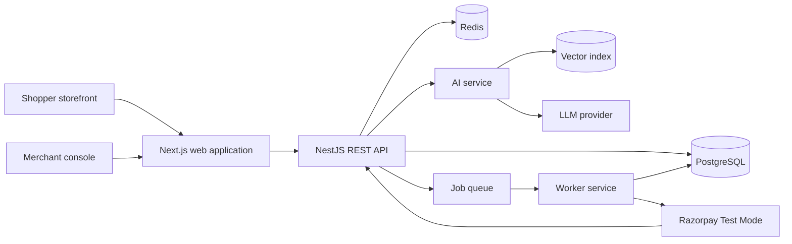
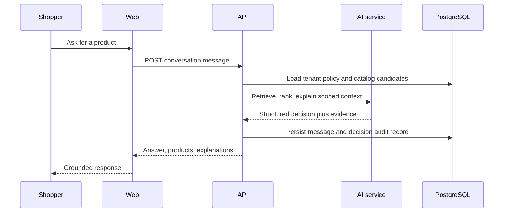
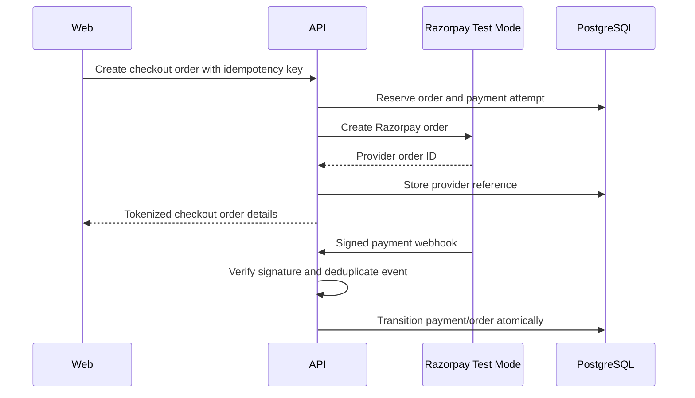
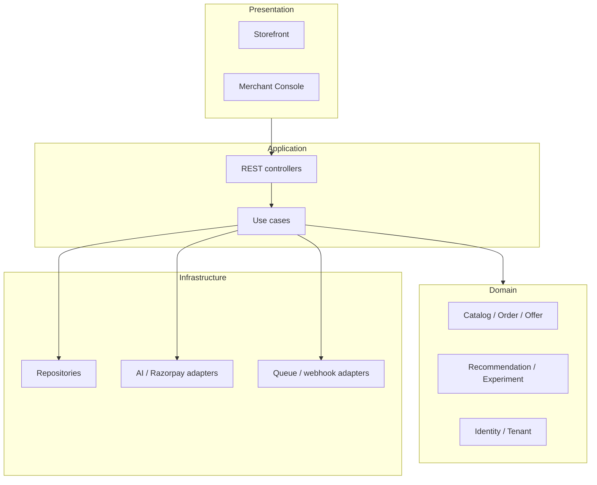

# Architecture

## System architecture

MerchantPilot AI is a multi-tenant modular monolith at its transactional core, with separately deployable AI and worker services. This avoids premature distributed complexity while preserving boundaries for workloads that scale differently. PostgreSQL is the system of record; Redis and vector indexes are rebuildable derived stores.

## Frontend architecture

Next.js provides merchant-console and shopper route groups. Server components render data-intensive views; client components are constrained to interactive state. A typed API client generated from the published OpenAPI contract isolates UI from transport details. Feature modules own pages, view models, accessibility, and analytics emission. The browser never receives service credentials or calls payment-provider secrets directly.

## Backend architecture

NestJS implements independently testable modules: identity, tenants, catalog, inventory, conversations, recommendations, offers, checkout, payments, experiments, analytics, and audit. Each exposes application use cases and ports; adapters implement persistence, queues, AI calls, and Razorpay. Cross-module integration uses explicit commands/events, not direct table access.

## AI architecture

The AI service is an orchestration boundary, not the source of truth. It retrieves tenant-scoped approved product and knowledge chunks, applies deterministic eligibility/safety filters, ranks candidates, then optionally generates an answer constrained to supplied evidence. Output is structured: answer, product IDs, confidence, reason codes, source references, policy decisions, and model metadata. The API persists an immutable recommendation decision before presentation.

No model may invent price, availability, promotions, delivery promises, payment state, or policy. Missing evidence produces calibrated uncertainty and a safe fallback.

## Data flow

1. A shopper action is authenticated or assigned an anonymous session with tenant/storefront context.
2. The API validates it, resolves policy, and retrieves catalog candidates.
3. AI retrieval/ranking receives minimised tenant-scoped context; deterministic filters remove ineligible products.
4. The API persists an explanation-bearing decision and returns eligible items.
5. Impressions, clicks, cart actions, orders, and refunds emit idempotent commerce events.
6. Workers process webhooks, attribution, embeddings, exports, and notifications with retries/dead-letter handling.

## Sequence diagrams

## Component diagram

## Clean Architecture layers

| Layer          | Responsibility                                                    | Dependency rule                                 |
| -------------- | ----------------------------------------------------------------- | ----------------------------------------------- |
| Domain         | Entities, value objects, invariants, domain events                | Depends on nothing outside domain               |
| Application    | Use cases, transaction boundaries, ports, authorization decisions | Depends on domain abstractions                  |
| Interface      | REST controllers, DTO mapping, web views, webhooks                | Depends inward on application contracts         |
| Infrastructure | PostgreSQL, Redis, queue, LLM, Razorpay adapters                  | Implements ports; never defines business policy |

Tenant ID, actor identity, correlation ID, idempotency key, and authorization context are explicit at every boundary. Background jobs propagate them in metadata.
