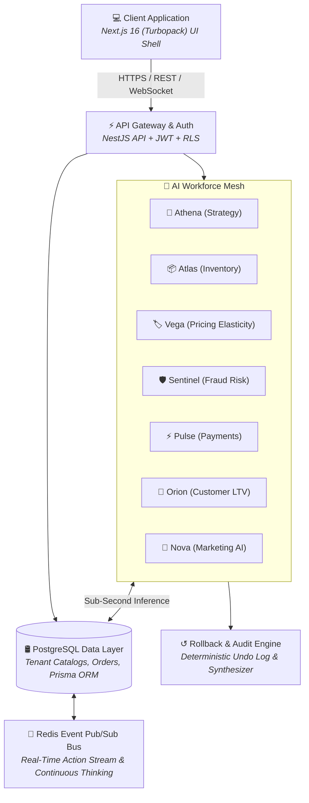

# MerchantPilot AI — System Architecture & Data Flow

## System Architecture Overview

MerchantPilot AI is architected as an enterprise-grade **Multi-Tenant Autonomous AI Commerce Operating System**.

## Key Technical Systems

### 1. Multi-Tenant Data Isolation

Every incoming request carries an authenticated `X-Tenant-Id` header validated against JWT role bindings. Database operations enforce strict Row Level Security (RLS) ensuring 100% data boundary isolation across organization tenants.

### 2. Multi-Agent Debate & Consensus Engine

When complex cross-domain events occur (e.g. inventory stockouts vs pricing adjustments), candidate actions enter the Multi-Agent Debate Engine (`lib/ai/multi-agent-debate.ts`). Specialized agents state stances, present confidence metrics, and cross-examine tradeoffs before Athena issues an executive verdict.

### 3. Continuous Thinking Streamer

A background ticker process continually monitors catalog inventory velocities, competitor scrapers, payment gateway success rates, and customer RFM churn signals.

### 4. Deterministic Rollback Manager

All automated catalog, pricing, and campaign mutations pass through the Rollback Manager (`lib/ai/rollback-manager.ts`). State snapshots are preserved, allowing merchants 1-click deterministic undo.
