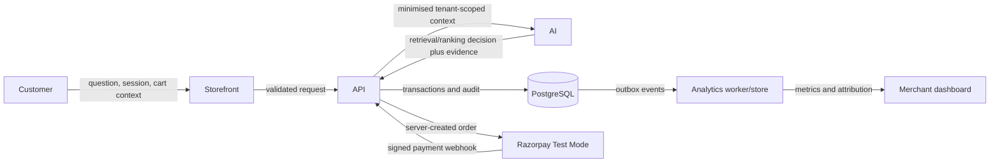

# Data Flow

## Primary flow

## Transition rules

| From → To | Data transferred | Required controls | Result |
|---|---|---|---|
| Customer → Storefront | Message, product/cart interaction, session cookie | CSP, secure session handling, client-side input limits; no secrets | Intent-bearing request UI |
| Storefront → API | JSON DTO, session/storefront identity, correlation ID | TLS, schema validation, CSRF/session protections where applicable, rate limit | Authorized request context |
| API → AI | Redacted message, structured conversation summary, tenant ID, policy, candidate facts | Tenant scope, PII minimisation, typed read-only tools, timeout, no payment/secret access | Structured AI decision candidate |
| AI → API | Intent, selected IDs, confidence, explanation, evidence, model metadata | JSON-schema validation, evidence fact check, policy enforcement | Displayable decision or suppression/fallback |
| API → Database | Catalog/order/payment state, decision audit, events | Transaction boundaries, RLS, encryption where needed, idempotency, append-only ledgers | Authoritative record |
| API → Razorpay | Server-calculated order amount, currency, provider reference | Server secret, idempotency, provider timeout/circuit breaker; Test Mode credentials only | Provider order identifier |
| Razorpay → API | Signed webhook event | Signature verification, payload limit, timestamp/replay check, event-id deduplication | Authoritative payment-state transition |
| Database → Analytics | Outbox events with tenant/decision/order lineage | Idempotent consumer, schema versioning, PII minimisation, retry/dead-letter queue | Attributed metrics and freshness state |
| Analytics → Merchant | Aggregated scoped metrics, experiment results, decision trace links | RBAC, tenant filter, freshness timestamp, no raw secrets | Actionable growth insight |

## Data classification and retention

| Class | Examples | Handling |
|---|---|---|
| Public catalog | Published title, attributes, price | Tenant-scoped access; versioned for evidence |
| Internal commercial | Policy, margin guardrails, experiment allocation | Merchant-role restricted; never sent to shopper or LLM unless needed as bounded policy |
| Personal data | Contact/shipping details, conversation text | Minimise, encrypt at rest where required, redact logs, retention/deletion controls |
| Payment-provider data | Provider IDs, payment state, signed payload | Do not store card data; encrypt sensitive payload; retention-limited |
| Security/audit | Request IDs, actor, deny events, policy decisions | Append-only, redacted, restricted access |

The database is the source of truth. Analytics is derived and may be eventually consistent; its dashboard must expose data freshness. AI/vector indexes are rebuildable projections and cannot independently create orders, payments, catalog records, or policy changes.
