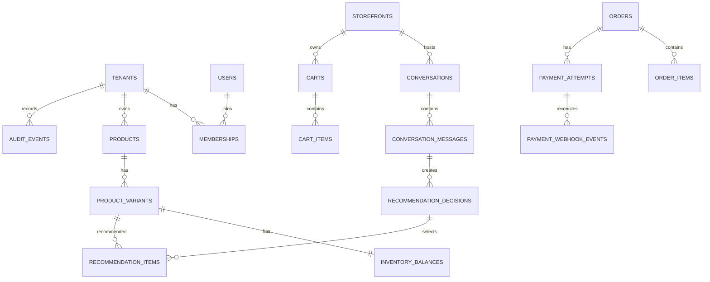

# Database Design

PostgreSQL is the authoritative transactional store. All tenant-owned tables carry `tenant_id`; application queries set a transaction-local tenant context and PostgreSQL row-level security restricts access as defense in depth. IDs use UUIDv7. Money is integer minor units plus a three-letter currency. Timestamps are `timestamptz` in UTC.

## ER diagram

## Tables

| Table                                   | Key columns and constraints                                                                   | Purpose                            |
| --------------------------------------- | --------------------------------------------------------------------------------------------- | ---------------------------------- |
| `tenants`                               | `id PK`, `slug UNIQUE`, `status CHECK`, timestamps                                            | Merchant-account boundary          |
| `users`                                 | `id PK`, `oidc_subject UNIQUE`, `email CITEXT UNIQUE`, `status`                               | Human identity; no password hashes |
| `memberships`                           | tenant/user FKs, role, `UNIQUE(tenant_id,user_id)`                                            | Tenant role assignment             |
| `storefronts`                           | tenant FK, `public_key UNIQUE`, status, allowed origins JSONB                                 | Shopper channel configuration      |
| `products`                              | tenant FK, handle, title, status, attributes JSONB, unique tenant/handle                      | Merchant product                   |
| `product_variants`                      | tenant/product FKs, SKU, `price_minor CHECK >=0`, currency, unique tenant/SKU                 | Sellable SKU                       |
| `inventory_balances`                    | variant PK/FK, tenant FK, available/reserved `CHECK >=0`, version                             | Concurrency-controlled stock       |
| `product_embeddings`                    | tenant/product FK, vector embedding, model version, content-hash unique                       | Rebuildable retrieval projection   |
| `customers`                             | tenant FK, external ref, email hash, consent state, unique tenant/ref                         | Minimised shopper identity         |
| `shopper_sessions`                      | tenant/storefront/customer FKs, token hash unique, expiry                                     | Opaque shopper session             |
| `conversations`                         | tenant/session FKs, status, locale                                                            | Conversation aggregate             |
| `conversation_messages`                 | tenant/conversation FK, actor, content/redacted content, sequence unique per conversation     | Immutable history                  |
| `recommendation_decisions`              | tenant FK, source message nullable FK, context hash, policy/model version, explanation JSONB  | Immutable explainable decision     |
| `recommendation_items`                  | decision/variant FKs, positive rank, score, reason codes, evidence JSONB                      | Ranked outputs                     |
| `offers`                                | tenant FK, rule JSONB, discount type, status, active-range check                              | Merchant-defined upsell offer      |
| `carts`, `cart_items`                   | tenant/session FKs; positive quantity; cart/version                                           | Basket aggregate and lines         |
| `orders`, `order_items`                 | tenant/cart FKs; order number unique; total checks; item price snapshots                      | Immutable purchase commitment      |
| `payment_attempts`                      | tenant/order FKs, provider, provider order/payment IDs unique, status, amount/currency        | Payment lifecycle                  |
| `payment_webhook_events`                | provider event ID unique, signature validity, encrypted payload, processing outcome           | Idempotent webhook ledger          |
| `experiments`, `experiment_assignments` | tenant/key unique; stable subject-hash assignment                                             | Controlled experiments             |
| `commerce_events`                       | tenant, event name/time, session/decision/order FKs, idempotency key unique, JSONB properties | Append-only attribution stream     |
| `idempotency_keys`                      | tenant/key primary key, request hash, response, expiry                                        | Safe write replay                  |
| `outbox_events`                         | aggregate, event type/payload, publication/attempt fields                                     | Transactional publication          |
| `audit_events`                          | tenant, actor/action/target, redacted before/after JSONB, request ID                          | Investigations and compliance      |

## Relationships and constraints

- Every child tenant ID equals its parent tenant ID; use composite foreign keys where practical and domain checks otherwise.
- Products and variants are soft-deactivated, never hard-deleted after references exist.
- Orders, order items, recommendation decisions, payment events, commerce events, and audit events are append-only.
- Order state transitions and inventory reservations happen in one serializable transaction or explicit aggregate-version lock.
- A payment attempt's amount/currency must equal its order's payable total; provider references are globally unique.
- Raw payment signatures are never persisted. Webhook payloads are encrypted and retention-limited.

## Indexes

- B-tree composites: `(tenant_id, status, updated_at DESC)` for products; `(tenant_id, product_id)` for variants; `(tenant_id, created_at DESC)` for orders, decisions, and audits.
- Unique tenant indexes for product handle, SKU, experiment key, and idempotency key.
- Partial indexes for active products/offers, unprocessed outbox events, and pending payment attempts.
- GIN only for intentional JSONB filter fields and reason-code arrays.
- HNSW/IVFFlat vector index with tenant/category filtering strategy; benchmark before selection.
- Time-partition commerce, audit, and webhook-ledger events monthly when volume warrants it.

## Future scalability

Begin with one PostgreSQL primary and reporting replicas. Replicate through the outbox to a warehouse rather than running heavy analytics on transaction tables. Partition append-only tables by time, archive by retention policy, and shard only after tenant-volume evidence. A retrieval port permits migration from pgvector to a dedicated vector store without changing commerce tables.
