# MerchantPilot AI - Database Entity-Relationship Diagram

The following Mermaid ER diagram illustrates all **25 entities**, primary keys, foreign key associations, and cardinalities in the MerchantPilot AI relational database.

```mermaid
erDiagram
    Merchant ||--o{ Role : "has roles"
    Merchant ||--o{ Store : "owns stores"
    Merchant ||--o{ MerchantPolicy : "configures policies"
    Merchant ||--o{ Offer : "offers promotions"
    Merchant ||--o{ Experiment : "runs A/B experiments"
    Merchant ||--o{ Conversation : "hosts shopper dialogues"
    Merchant ||--o{ Message : "records chat messages"
    Merchant ||--o{ Recommendation : "issues recommendations"
    Merchant ||--o{ Cart : "manages shopper carts"
    Merchant ||--o{ Order : "processes commercial orders"
    Merchant ||--o{ Payment : "receives payment transactions"
    Merchant ||--o{ AIExecution : "logs AI executions"
    Merchant ||--o{ AuditLog : "maintains compliance logs"
    Merchant ||--o{ WebhookEvent : "receives webhooks"
    Merchant ||--o{ AnalyticsEvent : "tracks funnel events"

    User ||--o{ Role : "assigned roles"
    User ||--o{ Conversation : "starts conversations"
    User ||--o{ Cart : "owns carts"
    User ||--o{ Order : "places orders"
    User ||--o{ AuditLog : "initiates audit events"

    Store ||--|| Catalog : "owns catalog"
    Store ||--o{ Product : "contains products"
    Store ||--o{ Inventory : "tracks stock"
    Store ||--o{ Conversation : "hosts storefront chats"
    Store ||--o{ Cart : "manages active store carts"
    Store ||--o{ Order : "receives orders"

    Catalog ||--o{ Category : "organizes categories"
    Category ||--o{ Category : "has subcategories"
    Category ||--o{ Product : "classifies products"

    Product ||--|| Inventory : "has real-time balance"
    Product ||--o{ CartItem : "in cart items"
    Product ||--o{ OrderItem : "purchased in order items"

    MerchantPolicy ||--o{ Offer : "governs offer rules"

    Experiment ||--o{ ExperimentVariant : "defines variants"
    Experiment ||--o{ Recommendation : "tests recommendation model"
    Experiment ||--o{ AnalyticsEvent : "evaluates variant performance"

    ExperimentVariant ||--o{ Recommendation : "assigned variant"
    ExperimentVariant ||--o{ AnalyticsEvent : "attributed analytics"

    Conversation ||--o{ Message : "contains chat history"
    Conversation ||--o{ Recommendation : "generates recommendations"
    Conversation ||--o{ Cart : "associated with active cart"
    Conversation ||--o{ Order : "converts to order"

    Message ||--o{ AIExecution : "triggers AI prompt execution"
    Message ||--o{ Recommendation : "results in recommendation"

    AIExecution ||--|| Recommendation : "produces recommendation"
    AIExecution ||--o{ AuditLog : "records execution trace"

    Recommendation ||--o{ RecommendationReason : "provides explanations"
    Recommendation ||--o{ AnalyticsEvent : "tracks impressions & clicks"

    Cart ||--o{ CartItem : "contains line items"
    Cart ||--o{ Order : "converts to checkout order"

    Order ||--o{ OrderItem : "contains purchased items"
    Order ||--o{ Payment : "has payment attempts"
    Order ||--o{ AnalyticsEvent : "tracks order funnel events"

    Payment ||--o{ WebhookEvent : "reconciled by webhooks"
```

## Entity Summary Table

| Entity | Primary Key | Key Relationships & Purpose |
|---|---|---|
| `Merchant` | `id` (UUID) | Tenant root boundary for stores, policies, and commerce ledgers. |
| `User` | `id` (UUID) | System user identity with unique email for merchant staff and shoppers. |
| `Role` | `id` (UUID) | Multi-tenant RBAC mapping linking users and merchants. |
| `Store` | `id` (UUID) | Merchant storefront configuration and public API key boundary. |
| `Catalog` | `id` (UUID) | Container for store categories and products. |
| `Category` | `id` (UUID) | Self-referencing category tree structure (`parentId`). |
| `Product` | `id` (UUID) | Sellable catalog item with unique SKU per store (`@@unique([storeId, sku])`). |
| `Inventory` | `id` (UUID) | Real-time stock balance (`availableQuantity`, `reservedQuantity`, `reorderThreshold`). |
| `MerchantPolicy` | `id` (UUID) | Queryable rules governing discount caps, thresholds, and AI boundaries. |
| `Offer` | `id` (UUID) | Commercial upsell promotions governed by merchant policies. |
| `Experiment` | `id` (UUID) | A/B test container for testing prompt policies and recommendation algorithms. |
| `ExperimentVariant` | `id` (UUID) | Prompt/model configuration variants with traffic allocation. |
| `Conversation` | `id` (UUID) | Shopper discovery dialogue session. |
| `Message` | `id` (UUID) | Immutable history of shopper and AI assistant chat messages. |
| `Recommendation` | `id` (UUID) | AI recommendation item with predicted revenue lift & confidence. |
| `RecommendationReason`| `id` (UUID) | Granular reasons and match scores explaining recommendation items. |
| `Cart` | `id` (UUID) | Shopper basket session aggregate. |
| `CartItem` | `id` (UUID) | Line items inside shopper carts (`@@unique([cartId, productId])`). |
| `Order` | `id` (UUID) | Commercial commitment with unique order number and Razorpay order ID. |
| `OrderItem` | `id` (UUID) | Immutable snapshot of purchased products and prices. |
| `Payment` | `id` (UUID) | Payment attempt lifecycle with unique Razorpay payment ID. |
| `AIExecution` | `id` (UUID) | Execution log detailing intent, retrieved products, candidate scores, and latency. |
| `AuditLog` | `id` (UUID) | Compliance ledger capturing correlation IDs, before/after JSON diffs, and actors. |
| `WebhookEvent` | `id` (UUID) | Inbound Razorpay/gateway event ledger with unique event IDs. |
| `AnalyticsEvent` | `id` (UUID) | Funnel metrics event stream for revenue attribution and conversion tracking. |
