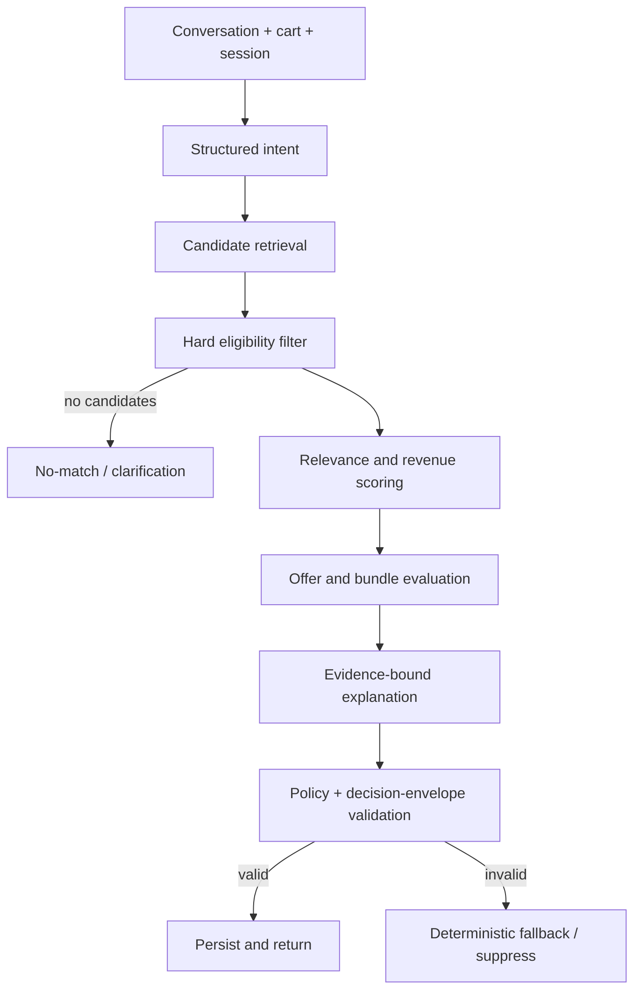

# Decision Engine

## Purpose

The decision engine turns a qualified customer intent and eligible product set into the best explainable commerce action: recommend products, propose an optional bundle/upsell, ask for clarification, or safely return no recommendation. It joins AI signals with deterministic merchant policy and revenue goals.

## Decision stages

## Inputs and authoritative sources

| Input                              | Source                        | Authority                                           |
| ---------------------------------- | ----------------------------- | --------------------------------------------------- |
| Intent and explicit constraints    | Conversation agent            | Advisory; customer statements remain authoritative  |
| Product metadata and compatibility | Published catalog             | Authoritative product facts                         |
| Price and currency                 | Variant pricing service       | Authoritative at response and checkout time         |
| Stock                              | Inventory balance             | Authoritative at response and rechecked at checkout |
| Margin and inventory goal          | Merchant policy/configuration | Internal bounded scoring signal                     |
| Offer eligibility                  | Offer/policy engine           | Deterministic authority                             |
| Experiment variant                 | Assignment service            | Deterministic stable assignment                     |

## Hard eligibility rules

A candidate shall be removed before scoring when it is not published, not active, out of stock, incompatible with an explicit requirement, outside a stated hard budget, disallowed by merchant policy, excluded by a shopper, duplicated in the cart for upsell, or lacks evidence for an explanation. A candidate cannot re-enter through a model suggestion.

## Ranking and revenue score

The engine calculates a transparent score per remaining candidate. All terms are normalized to 0–1, versioned, and stored.

`final_score = relevance_gate × (0.40 × conversion_likelihood + 0.30 × merchant_margin_score + 0.20 × inventory_priority + 0.10 × merchant_goal_alignment)`

`relevance_gate` is zero when hard eligibility fails. Otherwise it reflects semantic/use-case, attribute, and budget fit.

| Component               | Definition                                                                            | Constraint                                                    |
| ----------------------- | ------------------------------------------------------------------------------------- | ------------------------------------------------------------- |
| Conversion likelihood   | Calibrated estimate of click/add-to-cart propensity from current intent-candidate fit | No protected attributes; no cross-merchant customer profiling |
| Merchant margin score   | Normalized merchant-configured margin band                                            | Not shown as a customer benefit and cannot defeat relevance   |
| Inventory priority      | Merchant-set priority for eligible stock                                              | Cannot select unavailable stock or force urgency claims       |
| Merchant goal alignment | Match to conversion, AOV, premium adoption, or stock reduction goal                   | Goal must be explicit, time-bounded, and auditable            |

Default weights are `0.40/0.30/0.20/0.10`. Policy limits each to 0–0.50 and requires total 1.00. Missing components are renormalized and recorded. No revenue estimate exists without configured calibration.

## Offer and bundle evaluation

Offers are evaluated after the base recommendation qualifies. A bundle must be complementary, compatible where relevant, in stock, policy-allowed, and financially valid. Merchant rules such as “never discount Apple products”, “minimum margin 20%”, “do not bundle competitor products”, and “premium recommendation minimum price ₹500” are hard rules. The selected offer includes eligibility rule IDs, discount basis, expected cart delta, and a customer-safe explanation. It never creates or changes a discount.

## Outputs and invariants

| Outcome                  | Required behavior                                                                           |
| ------------------------ | ------------------------------------------------------------------------------------------- |
| Qualified recommendation | Policy-capped items, rank, reason codes, evidence, confidence, score breakdown, decision ID |
| Qualified upsell         | Optional offer/bundle, eligibility evidence, basket delta if calculable, decision ID        |
| Clarification            | Focused question for missing high-impact information                                        |
| No match                 | Honest no-match plus deterministic browse/filter path                                       |
| Suppression              | Do not display invalid/blocked output; persist reason and fallback state                    |

- Every selected and rejected candidate has a machine-readable reason.
- Price, availability, discount, and payment claims originate from authoritative API facts—not LLM text.
- Output passes the decision envelope in [ai-agent-design.md](ai-agent-design.md) before response.
- The engine is deterministic for a fixed input snapshot, policy version, model version, and experiment variant.

## Revenue attribution

The engine emits `recommendation.impressed`, `recommendation.clicked`, `cart.item_added`, `checkout.started`, `payment.confirmed`, and `order.refunded` events linked by `decision_id`, session, cart, and order. Reports show observed association. Only controlled experiment analysis may call an outcome incremental lift.
