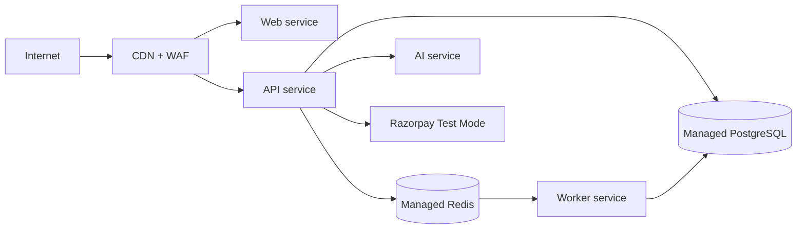

# Deployment

## Development environment

Local development will run web, API, AI service, worker, PostgreSQL, and Redis in isolated containers or managed local equivalents. Developers use synthetic data and Razorpay Test Mode only. Configuration is loaded from an uncommitted local environment file and validated at startup. Pre-commit checks run formatting, type checks, tests, and secret scanning. No container, compose file, or runtime setup is created in this documentation phase.

## Docker

Each deployable application will use a minimal pinned base image and multi-stage build. Images run as non-root users, have read-only filesystems where practical, expose only required ports, and include health checks. Build arguments cannot carry secrets. CI produces immutable signed images with SBOMs; tags include the commit SHA. Development composition stays separate from production orchestration.

## Production

Deploy web, API, AI service, and worker independently behind private networking. Use managed PostgreSQL with backups, point-in-time recovery, encryption, and replica monitoring; use managed Redis with TLS and persistence appropriate to queue durability. Place web/API behind a WAF, CDN, and load balancer. AI traffic uses egress controls and timeouts. Media lives in private object storage with signed access. Centralize logs, metrics, traces, security signals, and audit retention.

## CI/CD

Pull requests run linting, formatting, type checks, unit/contract tests, migration validation, secret scanning, dependency/SAST scanning, and build reproducibility checks. Protected branches require review and passing checks. A merge builds a signed immutable artifact, deploys staging, runs integration/E2E/security smoke tests, then requires explicit production promotion. Migrations are reviewed, backwards compatible, and execute through a dedicated job.

## Environment variables

| Category | Required configuration |
|---|---|
| Runtime | environment, service, public URL, CORS origins, log level |
| Data | database/Redis URLs, connection limits, encryption/KMS reference |
| Identity | OIDC issuer, audience, client IDs, redirect URIs |
| Payments | Razorpay Test Mode key ID, secret, webhook secret, API base URL |
| AI | provider key, model IDs, embedding model, limits, retention setting |
| Observability | OpenTelemetry endpoint, metrics credentials, error-reporting DSN |
| Jobs | queue namespace, concurrency, retry/dead-letter policy |

Production startup fails closed if secrets are absent, placeholder values appear, or public settings are incompatible. Deployment injects secrets; CI never emits them.

## Deployment workflow

1. Review change, threat impact, migration plan, and rollback procedure.
2. Merge after protected CI and artifact-provenance checks.
3. Deploy staging with a production-like schema and test Razorpay Test Mode webhook verification.
4. Promote immutable image with canary/rolling deployment; monitor errors, latency, queue depth, payment-event processing, and business guardrails.
5. Roll back application artifacts for regressions. Use forward-only compensating migrations unless a tested restore is approved.
6. Record release metadata, incidents, and operational decisions.

## Resilience and recovery

Define SLOs before production. Test PostgreSQL point-in-time restore on a schedule and retain encrypted backups per policy. Queue jobs are idempotent and dead-lettered after bounded retries. Readiness and liveness are separate. Disaster-recovery exercises validate recovery objectives, webhook replay safety, and payment/order reconciliation.
