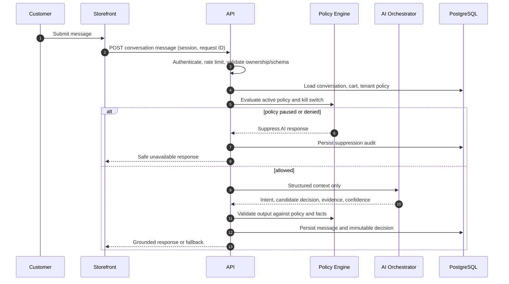
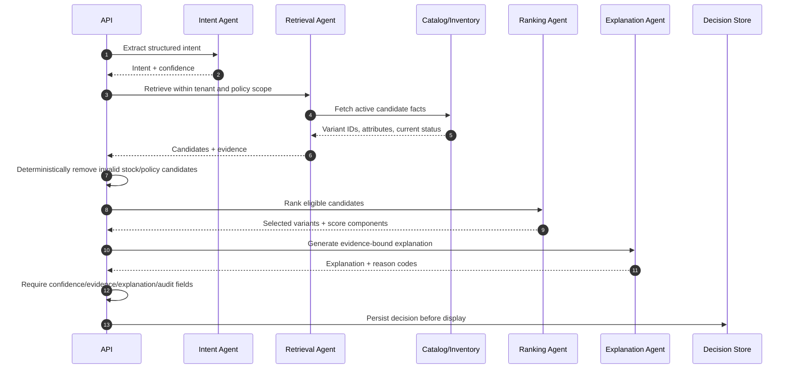

# Sequence Diagrams

## Conversation flow



## Recommendation flow



## Checkout flow

```mermaid
sequenceDiagram
  autonumber
  participant C as Customer
  participant W as Storefront
  participant API as API
  participant DB as PostgreSQL
  participant R as Razorpay Test Mode
  C->>W: Checkout cart
  W->>API: POST order + Idempotency-Key
  API->>DB: Lock cart; reprice and validate inventory/session
  alt invalid cart or stock mismatch
    API-->>W: 409 current price/availability
  else valid
    API->>DB: Create pending order/payment attempt, reserve stock
    API->>R: Create provider order with server amount
    alt provider responds
      R-->>API: Provider order ID
      API->>DB: Persist provider reference/outbox event
      API-->>W: Public checkout fields
    else timeout
      API->>DB: Persist retry-safe pending outcome
      API-->>W: Retry-safe processing response
    end
  end
```

## Webhook flow

```mermaid
sequenceDiagram
  autonumber
  participant R as Razorpay Test Mode
  participant API as Webhook API
  participant DB as PostgreSQL
  participant Q as Worker Queue
  R->>API: Event payload + signature
  API->>API: Enforce size/time limits; verify signature
  alt invalid signature
    API->>DB: Audit rejected event metadata
    API-->>R: 401/400
  else valid
    API->>DB: Insert provider event idempotently
    alt duplicate event
      API-->>R: 200 already processed
    else new event
      API->>DB: Validate provider/order amount/currency/state; transition atomically
      API->>Q: Enqueue attribution/reconciliation event
      API-->>R: 200 acknowledged
    end
  end
```
